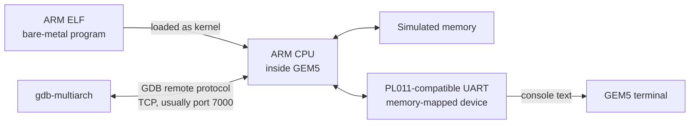

# Lab 1 — Run and debug a bare-metal program with GEM5

## What you will learn

You will run a small ARM program without an operating system. GEM5 models the
processor, memory, and UART device; the program's UART output appears in the
terminal. You can then pause the simulated CPU and inspect it with GDB.

This is a **software connection to simulated hardware**. You do not connect
USB, UART, keyboard, or JTAG wires to a physical board for this lab.

## How the pieces connect



The program writes characters to the UART's memory-mapped registers. In the
provided UART driver, `UART_BASE0` is `0x1c090000`. GEM5 routes those accesses
to its simulated UART and prints the transmitted characters in the terminal.
GDB, when enabled, communicates with the simulated CPU over a debugger socket;
it is not the same connection as the UART console.

## Before you begin

- Linux or WSL with a terminal.
- The **authorized Lab 1 starter pack** from your instructor. It should contain
  the C/assembly sources, `Makefile`, and `memmap`.
- An ARM cross-compiler/binutils matching the `ARMGNU` prefix you use.
- A GEM5 build with the ARM target enabled (`build/ARM/gem5.opt`).
- Optional: `gdb-multiarch` for interactive debugging.

The course starter pack is not mirrored here because its files do not provide
clear permission for redistribution. The guide assumes you extract it into
`Lab 1/` so `Lab 1/Makefile` and `Lab 1/memmap` are available.

On Debian or Ubuntu, install the common host tools and ARM cross-compiler with:

```sh
sudo apt update
sudo apt install build-essential git python3 python3-dev scons \
  gcc-arm-linux-gnueabi binutils-arm-linux-gnueabi gdb-multiarch
```

GEM5 has additional version-specific build dependencies; install those from
the [upstream GEM5 build guide](https://www.gem5.org/documentation/general_docs/building).
Then build its ARM target:

```sh
git clone https://github.com/gem5/gem5.git "$HOME/gem5"
cd "$HOME/gem5"
scons build/ARM/gem5.opt -j2
export GEM5_ROOT="$HOME/gem5"
```

The GEM5 build can take a while. If your course provides a tested GEM5
checkout, use it instead of building a different release.

## Build the program

Check that the cross-compiler tools are on your `PATH`. For example, on Debian
or Ubuntu, the `arm-linux-gnueabi-` prefix is commonly provided by the
`gcc-arm-linux-gnueabi` and `binutils-arm-linux-gnueabi` packages.

```sh
cd "Lab 1"
command -v arm-linux-gnueabi-gcc
make clean
make -f Makefile built.elf ARMGNU=arm-linux-gnueabi TARCH=-march=armv7-a
file built.elf
```

Use the prefix installed on your system if it differs. The explicit
`built.elf` target avoids the starter Makefile's machine-specific default GEM5
paths. This example selects ARMv7-A; use it only if the course GEM5 CPU model
supports that ISA, or substitute the course's required target. The output is
a program image for the simulator, not a host executable.

If your course pack already supplies `built.elf`, you may use that image
instead. Only run `make clean` when you intend to rebuild: it deletes
generated files, including an existing `built.elf`. Build your own when you
change the source.

## Run in GEM5

Set `GEM5_ROOT` to the directory containing the GEM5 checkout and run from
`Lab 1/`:

```sh
export GEM5_ROOT=/path/to/gem5
"$GEM5_ROOT/build/ARM/gem5.opt" \
  "$GEM5_ROOT/configs/deprecated/example/fs.py" \
  --bare-metal \
  --machine-type=VExpress_GEM5_V1 \
  --kernel="$PWD/built.elf"
```

The configuration script is from the workshop's GEM5 flow and may not exist
in every modern GEM5 release. If GEM5 reports that the script is missing or
rejects an option, use the version/configuration supplied for the course
rather than silently substituting a different machine model.

### Check that it worked

The simulated terminal should print:

```text
Hello from kickoff_baremetal.c
```

It then prints a 12-by-12 multiplication table in hexadecimal and enters the
monitor. The line format is hexadecimal; for example, decimal 11 is printed as
`00B`.

## Optional: inspect the CPU with GDB

Start GEM5 with the remote debugger enabled on port 7000 if that option is
supported by the course configuration. In a second terminal, from `Lab 1/`:

```sh
gdb-multiarch built.elf
```

At the GDB prompt:

```gdb
target remote :7000
info registers
x/8wx 0x10000
stepi
continue
```

If GDB cannot connect, check that GEM5 is still running, that its remote GDB
stub is enabled, and that the port in the GEM5 command matches the port in
`target remote`. The UART output remains in the GEM5 terminal, not the GDB
terminal.

## Troubleshooting

- **`arm-linux-gnueabi-gcc: command not found`:** install the cross-compiler or
  set `ARMGNU` to the prefix actually installed.
- **GEM5 cannot find `fs.py`:** use the course's tested GEM5 checkout and
  configuration; GEM5 has changed its example configurations over time.
- **Illegal instruction or unrecognized architecture:** rebuild with the
  course-compatible ARM target and confirm the simulated machine matches it.
- **No UART output:** verify the correct ELF was loaded and that its UART
  address/driver matches the simulated machine.

Build products such as `.o`, `.elf`, and `.dis` files are generated locally and
are not needed to read this guide.
