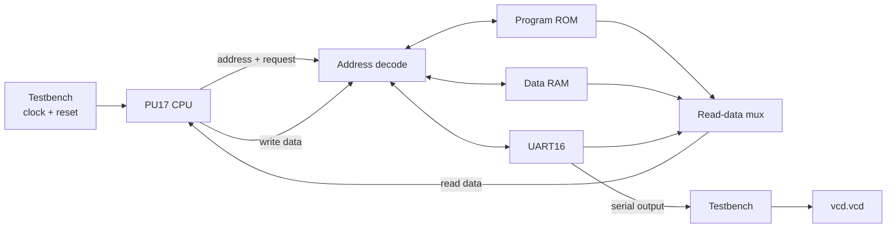

# Lab 2 — Simulate the PU17 processor and read its waveform

## What you will learn

You will simulate a small 16-bit processor and the memory and UART around it.
The testbench clocks the processor, releases reset, runs a short program that
computes a greatest common divisor (GCD), and records signal activity in a
VCD waveform file.

## How the simulated system connects



All connections in this diagram are **Verilog signals inside the testbench**.
There is no physical processor or serial cable to wire up. The testbench
selects ROM, RAM, or UART using the address bus and returns the selected
device's read data to the CPU.

## Before you begin

- Linux or WSL.
- The authorized PU17 workshop starter pack from your instructor, extracted
  under `Lab 2/`. It contains `Makefile`, the `rtl/` directory, assembly test
  source, and small host tools.
- Icarus Verilog (`iverilog` and `vvp`), GNU `make`, and a C compiler.
- GTKWave is optional and is needed only to open the waveform interactively.

The course processor RTL and supplied diagrams are not redistributed in this
repository. Obtain them from the authorized course source. The steps below
assume the extracted folder is named
`soc25-skills2-ws-starterpack-pu17`.

On Debian or Ubuntu, install the simulator and build tools with:

```sh
sudo apt update
sudo apt install build-essential make iverilog gtkwave
```

GTKWave is optional; omit it if you only need the text output.

## Run the test

```sh
cd "Lab 2/soc25-skills2-ws-starterpack-pu17"
iverilog -V
make
```

The Makefile assembles the GCD test, converts the ROM image to Verilog,
compiles the processor/testbench, and runs the simulation. Run plain `make`
without `-j`: the starter Makefile cleans and builds through ordered
prerequisites.

Expected behavior includes a message that the UART `'K'` finish marker was
detected. The testbench stops after that marker. In the supplied program, the
two result registers should both contain `0x0019` (25 decimal).

## Open the waveform

The testbench writes `vcd.vcd` in the starter-pack directory. Open it with:

```sh
gtkwave vcd.vcd
```

In GTKWave, expand `SIMSYS` and add `clk`, `reset`, `abus16`, `opreq`,
`rwbar`, `cpu_writed16`, `cpu_readd16`, and the CPU's program-counter and
register signals. Zoom to fit, then inspect the time around the testbench's
UART `'K'` write. The waveform is a record of the simulation, not a schematic.

For a text-only check, the simulator's log should contain the backdoor finish
message and the final register values. If a VCD is not generated, confirm
that the testbench has `$dumpfile` and `$dumpvars` enabled and run `make` from
the extracted starter-pack directory.

## Troubleshooting

- **`iverilog: command not found`:** install Icarus Verilog using your Linux
  distribution's package manager.
- **Assembler or ROM-generation tool missing:** run `make` in the starter-pack
  directory so its tool sources can be compiled.
- **No `'K'` finish message:** check the simulator log for compile errors and
  ensure the intended ROM program was generated and loaded.
- **GTKWave is blank:** add signals from the hierarchy and zoom to fit; a VCD
  can be valid even when no traces have been added to the viewer.

VCD files and compiled test executables are generated outputs. They are not
required to run the lab again and are intentionally kept out of the published
guide repository.
