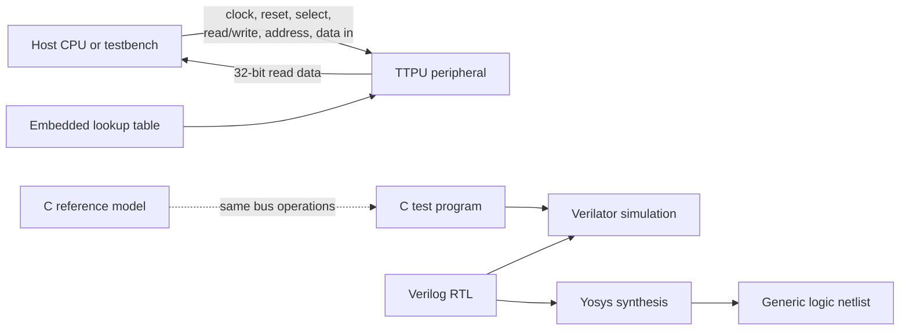

# Lab 3 — Model and synthesize the TTPU peripheral

## What you will learn

The Toy Trusted Processing Unit (TTPU) is a small memory-mapped device with a
programmer-visible register interface. In this lab you compare three views of
the same design:

1. A C model that is easy to test and understand.
2. Verilog RTL that describes clocked hardware.
3. A generic logic netlist produced by Yosys.

The example demonstrates a hardware peripheral and synthesis flow; it is not
a production cryptographic module.

## How the device connects to a host



The RTL has no external pins for a physical board in this exercise. The host
and device connect through `clk`, active-high `reset`, `sel`, `rwbar`, a
two-bit `addr`, and 32-bit input/output data buses. The test drives those
signals as bus transactions.

The simple programmer-visible address map is:

| Address | Read behavior | Write behavior |
| --- | --- | --- |
| `0` and other addresses | Device identifier/filler (`0x0000A5A4`) | No operation |
| `1` | Status flag and most recently generated 16-bit output | Consume a credit and process input data |
| `2` | Remaining operation credits | No operation |

Reset restores the credit counter and clears the bad-operation flag. Writing
when no credits remain sets the bad-operation flag. Refer to the authorized
course RTL/C source for exact cycle timing and bit definitions.

## Before you begin

- Linux or WSL.
- The authorized TTPU exercise source from your instructor, placed under
  `Lab 3/rtl/` and `Lab 3/tests/`. This repository intentionally does not
  redistribute course source whose licensing is unclear.
- GCC, GNU Make, and Yosys for the C model and synthesis.
- Verilator and a C++ compiler for the optional RTL simulation.

On Debian or Ubuntu, the common tools can be installed with:

```sh
sudo apt update
sudo apt install build-essential make yosys verilator
```

Check tool availability:

```sh
gcc --version
yosys -V
verilator --version
```

## Run the C reference-model test

From the repository root, after obtaining the authorized source:

```sh
gcc -std=c99 -Wall -Wextra -Werror -O2 -I"Lab 3/rtl" \
  "Lab 3/rtl/soc25-ttpu.c" "Lab 3/tests/test_ttpu.c" \
  -o /tmp/ttpu-c-test
/tmp/ttpu-c-test
```

The test exits successfully with no output when all assertions pass. It checks
reset state, the identifier/credit reads, a successful operation, credit
exhaustion, the bad-operation flag, and reset recovery.

## Simulate the RTL with Verilator

The starter pack includes a simulation harness. Follow its source names and
build instructions; the local workshop version can be built in a temporary
directory to keep generated files out of the source tree:

```sh
cd "Lab 3"
verilator --cc --top-module SOC25_TTPU101 \
  --prefix Vsoc25__02dttpu --Mdir /tmp/socworkshop-lab3-obj \
  --x-initial 0 --x-assign 0 rtl/soc25-ttpu.v
make -C /tmp/socworkshop-lab3-obj -f Vsoc25__02dttpu.mk -j2
g++ -std=c++17 -I/usr/share/verilator/include \
  -I/tmp/socworkshop-lab3-obj rtl/sim_main.cpp \
  /tmp/socworkshop-lab3-obj/verilated.o \
  /tmp/socworkshop-lab3-obj/Vsoc25__02dttpu__ALL.a \
  /tmp/socworkshop-lab3-obj/verilated_threads.o \
  -pthread -o /tmp/socworkshop-ttpu-sim
/tmp/socworkshop-ttpu-sim
```

If your installed Verilator uses different generated filenames or include
paths, consult its version-specific build instructions and the course harness.

## Synthesize with Yosys

The supplied `yosys.tcl` uses paths relative to the lab directory:

```sh
cd "Lab 3"
yosys -s yosys.tcl
```

The workshop run completed generic synthesis and Yosys `check -assert`. The
local run reported 584 generic cells. This is a generic-cell count, not a
standard-cell-mapped area estimate; Nangate45 mapping requires a compatible
library and configuration.

## Troubleshooting

- **C assertions fail:** first verify that the C model and test come from the
  same course version.
- **Verilator reports unknown startup values:** use the deterministic
  initialization options shown above, if supported by your installed version.
- **Yosys cannot find RTL:** run from `Lab 3/` and check that the authorized
  files are in `rtl/`.
- **No mapped area report:** generic synthesis is not technology mapping;
  mapping needs a permitted, correctly configured cell library.

Build directories, simulator executables, and synthesized netlists are
generated outputs. Keep them local and rerun the steps when needed.
