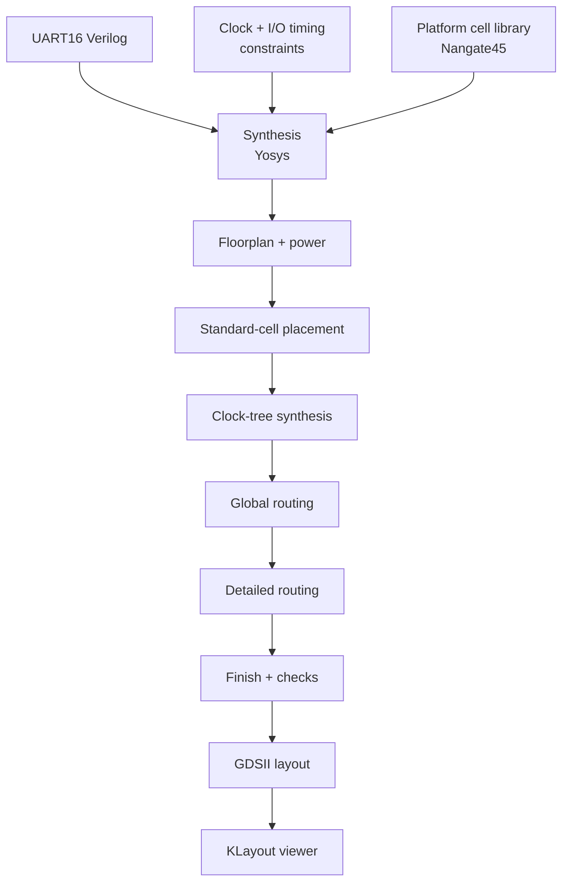

# Lab 4 — Take UART16 RTL through an ASIC physical-design flow

## What you will learn

This lab follows a UART16 design from RTL and timing constraints to a routed
layout. OpenROAD-flow-scripts (ORFS) runs the implementation stages and writes
a GDSII file that can be viewed in KLayout.

This is a digital-design exercise, not fabrication signoff. A successful GDS
export alone does not prove that timing, power, or design-rule requirements
are satisfied.

## Flow and connections between files



RTL describes the logic; the SDC describes timing expectations; the platform
library provides characterized cells. The flow uses these inputs to create
intermediate databases and layout files. These are tool files, not physical
cables. The design's UART serial pins are signal ports in the RTL.

## Before you begin

- Linux or WSL with Docker installed and running.
- The authorized UART16 workshop starter pack from your instructor. It
  contains the design RTL, SDC, and a design configuration.
- Internet access to obtain the OpenROAD-flow-scripts container image.
- Optional: KLayout on your host to inspect the final GDS file.

Install Docker using the [official instructions](https://docs.docker.com/engine/install/)
for your Linux distribution, start the Docker service, and confirm it is usable:

```sh
docker --version
docker info
```

The second command must complete without a daemon/permission error before you
run the flow.

The starter pack's RTL, notebook, photos, and diagrams are not mirrored here
because redistribution rights are not clear. Extract the authorized pack into
the repository root as `soc25-skills4-ws-starterpack-openroad/`. Clone the
upstream ORFS checkout as `OpenROAD-flow-scripts/` (the [upstream project](https://github.com/The-OpenROAD-Project/OpenROAD-flow-scripts)):

```sh
git clone https://github.com/The-OpenROAD-Project/OpenROAD-flow-scripts.git
docker pull openroad/orfs:latest
```

ORFS is a large tool/dependency checkout and is deliberately not stored in
this workshop repository.

## Run the physical-design flow

From the repository root, run the following command. It mounts the flow
scripts and the course design into the container, and keeps generated flow
outputs under `OpenROAD-flow-scripts/flow/`.

```sh
docker run --rm --user "$(id -u):$(id -g)" \
  --volume "$PWD/OpenROAD-flow-scripts/flow:/OpenROAD-flow-scripts/flow" \
  --volume "$PWD/soc25-skills4-ws-starterpack-openroad:/work/soc25-skills4-ws-starterpack-openroad:ro" \
  --workdir /OpenROAD-flow-scripts/flow \
  --env YOSYS_EXE=/OpenROAD-flow-scripts/tools/install/yosys/bin/yosys \
  --env OPENROAD_EXE=/OpenROAD-flow-scripts/tools/install/OpenROAD/bin/openroad \
  --env KLAYOUT_CMD=/usr/bin/klayout \
  --env DESIGN_HOME=/work/soc25-skills4-ws-starterpack-openroad/uart16-demo \
  --env DESIGN_CONFIG=/work/soc25-skills4-ws-starterpack-openroad/uart16-demo/config-soc25-uart-openroad-demo.mk \
  --env PLATFORM=nangate45 \
  --env DESIGN_NAME=UART16 \
  --env SYNTH_OPERATIONS_ARGS= \
  --entrypoint bash openroad/orfs:latest -lc \
  'make synth do-floorplan do-place do-cts do-route do-finish && make gds'
```

The flow writes results, logs, and reports below:

```text
OpenROAD-flow-scripts/flow/results/nangate45/UART16/base/
OpenROAD-flow-scripts/flow/logs/nangate45/UART16/base/
OpenROAD-flow-scripts/flow/reports/nangate45/UART16/base/
```

Look for `6_final.gds` in the results directory. Open it on a desktop system:

```sh
klayout OpenROAD-flow-scripts/flow/results/nangate45/UART16/base/6_final.gds
```

If running in a headless Codespace, copy the GDS to a machine with a graphical
desktop or use an available remote GUI. Do not expect a window to appear in a
headless terminal.

## Check and understand the result

Read the final report and the logs for each stage before relying on the result.
In the workshop run, the reported final cell area was about 541 µm² at roughly
43% utilization. The flow also reported unconstrained endpoints and unclocked
register/latch pins, and KLayout noted a DEF database-unit mismatch during
export. Treat those as items to investigate, not as harmless success messages.

## Troubleshooting

- **Docker daemon unavailable:** start Docker Desktop or the Codespaces Docker
  service available to your environment.
- **Missing design config or RTL:** confirm the course starter pack was
  extracted at the exact path shown above.
- **Missing OpenROAD/Yosys executables:** use the named ORFS image and check
  that Docker successfully pulled it.
- **GDS absent:** inspect the final `make` output; fix the first failing stage
  before looking for `6_final.gds`.
- **Warnings in timing or export:** inspect the SDC, reports, and technology
  setup; successful file export does not equal signoff.

The ORFS checkout and flow outputs are large, reproducible local dependencies.
They are intentionally not part of the published workshop guide.
