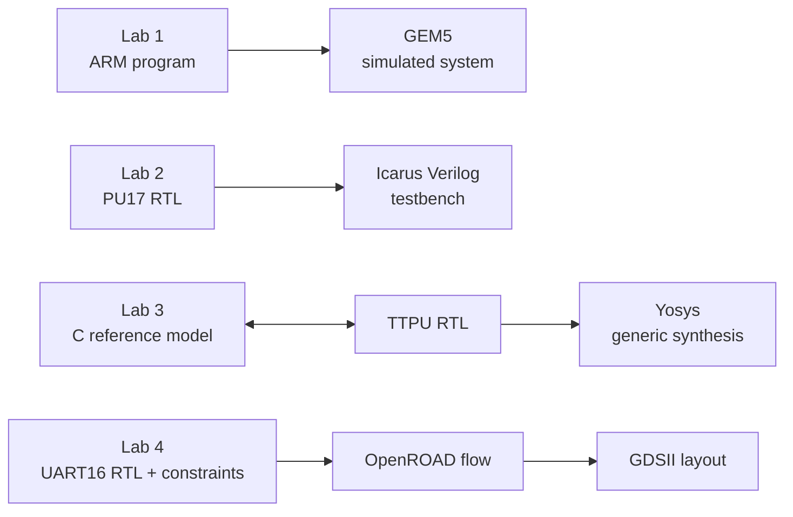

# SoC Design Workshop

A beginner's path through four connected parts of digital system design:
running software on a simulated computer, simulating a processor, modeling and
synthesizing a hardware peripheral, and taking RTL through an ASIC layout flow.
Each lab has its own guide with a block diagram, prerequisites, commands,
expected results, and troubleshooting.

> **Course files and licensing:** This repository publishes the workshop
> guides, not the separately supplied course starter packs. Some local course
> files identify University of Cambridge authors and do not include a
> redistribution license. Get those files from your instructor or their
> authorized course source. Do not upload them, their photos, or their
> screenshots unless you have permission to redistribute them.

## Start here

1. Install Git and a terminal (Linux or WSL is recommended). Lab-specific
   software is listed in each guide.
2. Clone this repository and open it in VS Code:

   ```sh
   git clone https://github.com/Seanjohn123-cyber/soc-workshop.git
   cd soc-workshop
   code .
   ```

3. Read the lab guide before installing tools or running commands. Obtain any
   required course starter pack from its authorized source and place it where
   the guide specifies.
4. Run one lab at a time. Keep generated build files and tool checkouts local;
   they can be large and are reproducible.

The diagrams in the guides use Mermaid and are rendered by GitHub directly in
the README pages. No physical board is required for the simulation-only
activities.

## Learning path

| Lab | Topic | What you will do | Guide |
| --- | --- | --- | --- |
| 1 | GEM5 and bare-metal software | Build or load an ARM ELF, run it on a simulated Versatile Express system, observe UART output, and optionally attach GDB. | [Lab 1 guide](./Lab%201/README.md) |
| 2 | PU17 processor RTL | Run an Icarus Verilog testbench, follow CPU/memory/UART bus activity, and inspect a waveform. | [Lab 2 guide](./Lab%202/README.md) |
| 3 | TTPU peripheral modeling | Compare a C reference model with Verilog RTL, run tests, and synthesize generic logic with Yosys. | [Lab 3 guide](./Lab%203/README.md) |
| 4 | ASIC physical design | Run synthesis, floorplanning, placement, clock-tree synthesis, routing, and GDS export with OpenROAD-flow-scripts. | [Lab 4 guide](./Lab%204/README.md) |

## How the labs fit together



The labs are designed to be understandable independently. Lab 1 and Lab 2
focus on simulation and observation; Lab 3 introduces a hardware device model;
Lab 4 shows how RTL, timing constraints, and a cell library become a physical
layout.

## Keeping the repository small

The `.gitignore` keeps local course distributions, simulator outputs, tool
checkouts, and build products out of ordinary Git commits. These are not
required to read the guides. Each lab explains how to regenerate its outputs
and where to obtain any separately licensed inputs.